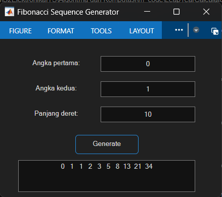

# Fibonacci Sequence Generator (MATLAB GUI)

## 📌 Project Title
Fibonacci Sequence Generator with MATLAB Graphical User Interface (GUI)

## 📖 Project Description
This project implements a **Fibonacci Sequence Generator** using MATLAB with a simple Graphical User Interface (GUI).  
The program allows the user to:
- Enter the **first number** of the sequence (default: `0`)
- Enter the **second number** of the sequence (default: `1`)
- Specify the **length of the sequence** (default: `10`)

Once the **Generate** button is pressed, the program calculates the Fibonacci sequence iteratively starting from the given two initial numbers.  
The results are displayed in a multiline text box, and validation is provided to ensure the sequence length is an integer greater than or equal to 2.

The GUI is built with MATLAB `figure` and `uicontrol` components for interactive design.

---

## 🛠 User Manual
1. Run the application by executing:
   ```matlab
   fibonacciseq
   ```
2. Enter the following in the input fields:
   - First number (e.g., `0`)
   - Second number (e.g., `1`)
   - Sequence length (e.g., `10`)
3. Press the **Generate** button.  
   - The Fibonacci sequence will appear in the output box.  
4. If the input is invalid, an error message will be displayed.

---

## 🖼 Preview
### Flowchart


### GUI Example


---

## 📅 Author
- **Habib Hammam Kurniawan**  
Class: Algoritma dan Komputasi  
Teacher: Muhammad Qomaruz Zaman, S.T., M.T., Ph.D.
