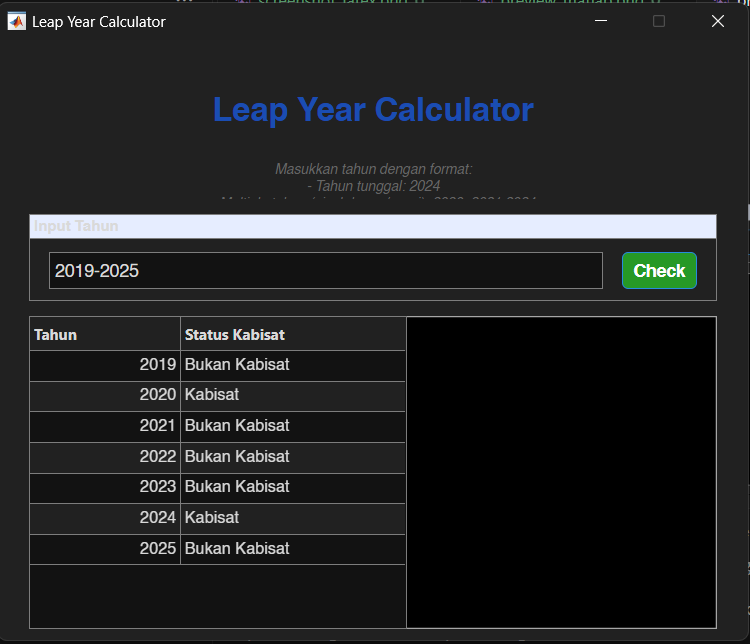

# Leap Year Calculator (MATLAB GUI)

## 📌 Project Title
Leap Year Calculator with MATLAB Graphical User Interface (GUI)

## 📖 Project Description
This project implements a **Leap Year Calculator** using MATLAB with a modern Graphical User Interface (GUI).  
The program supports multiple input formats:
- Single year (e.g., `2024`)
- Multiple years separated by commas or spaces (e.g., `2020, 2021 2024`)
- Year ranges (e.g., `2010-2015`)

The calculator applies the Gregorian calendar rules:
- A year is a leap year if it is divisible by **400**, or
- Divisible by **4** but not divisible by **100**

Results are displayed in a table with clear status labels, and alerts are shown for invalid input.  
The GUI is built with `uifigure`, `uigridlayout`, and `uitable` for interactive design.

---

## 🛠 User Manual
1. Run the application by executing:
   ```matlab
   leapYearApp
   ```
2. Enter the year(s) in the input field:
   - Single year: `2024`
   - Multiple years: `2020, 2021 2024`
   - Range: `2010-2015`
3. Press the **Check** button.  
   - The results will appear in a table.  
   - A status label summarizes the number of leap and non-leap years.  
4. Press **Clear** to reset the input and results.  

---

## 🖼 Preview
### Flowchart


### GUI Example
*(Optional: Insert a screenshot of your MATLAB GUI here if available)*  


---

## 📅 Author
- **Habib Hammam Kurniawan**  
Class: Algoritma dan Komputasi  
Teacher: Muhammad Qomaruz Zaman, S.T., M.T., Ph.D.
