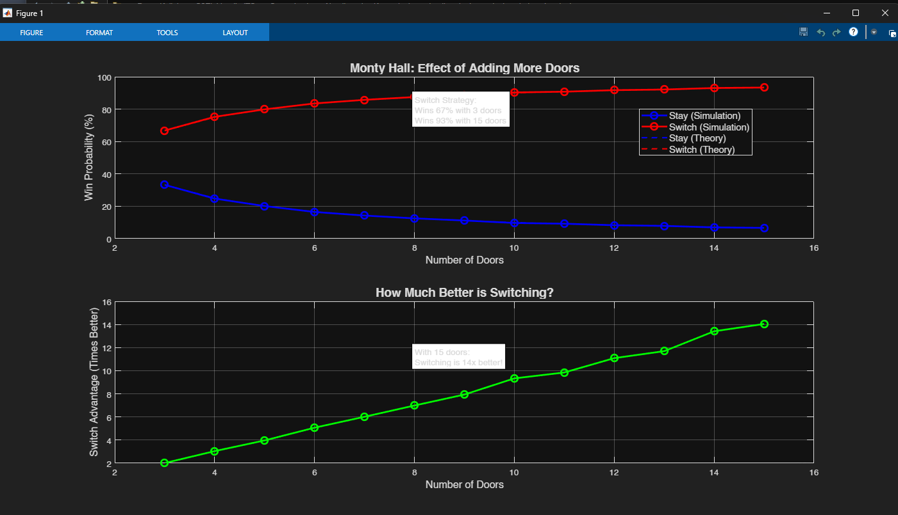

# Let's Make a Deal (Monty Hall Simulator)

## 📌 Project Title
Lets Make a Deal with MATLAB (Multi-Door Variant)

## 📖 Project Description
This project implements a **Monty Hall problem simulator** (also known as *Let's Make a Deal*) using MATLAB.  
The program extends the classic 3-door scenario into a **multi-door setup** (from 3 up to 15 doors).  

It estimates and compares the winning probabilities when the player:
- **Stays** with the initial door  
- **Switches** to the other unopened door after the host reveals all remaining goat doors  

The program:
- Runs thousands of randomized trials (default: 50,000 per door count)  
- Compares **simulation results** with **theoretical probabilities**  
- Produces a **table** in the Command Window and a **plot** visualizing the advantage of switching  

Theoretical probabilities:  
- Stay: `1/N`  
- Switch: `(N-1)/N`  

---

## 🛠 User Manual
1. Run the application by executing:
   ```matlab
   monty_hall_simulator
   ```
2. The program will automatically:
   - Simulate multiple door counts (3 to 15 doors).  
   - Print results in the Command Window in this format:  
     ```
     Doors | Stay (Act/Thy) | Switch (Act/Thy) | Advantage
     ------|----------------|------------------|----------
        3  | 0.333/0.333    | 0.667/0.667      | 2.0x
        5  | 0.200/0.200    | 0.800/0.800      | 4.0x
       10  | 0.100/0.100    | 0.900/0.900      | 9.0x
     ```
   - Generate a **plot** showing:
     - Simulation vs Theoretical win probabilities  
     - Switch advantage growth as doors increase  
3. No input is required; all parameters are adjustable in the source code:
   - `min_doors`, `max_doors` → door range  
   - `trials` → number of simulations  

---

## 🖼 Preview
### Flowchart


### Simulation Plot Example
*(Optional: Insert a screenshot of your MATLAB figure output here if available)*  


---

## 📅 Author
- **Habib Hammam Kurniawan**  
Class: Algoritma dan Komputasi  
Teacher: Muhammad Qomaruz Zaman, S.T., M.T., Ph.D.  
